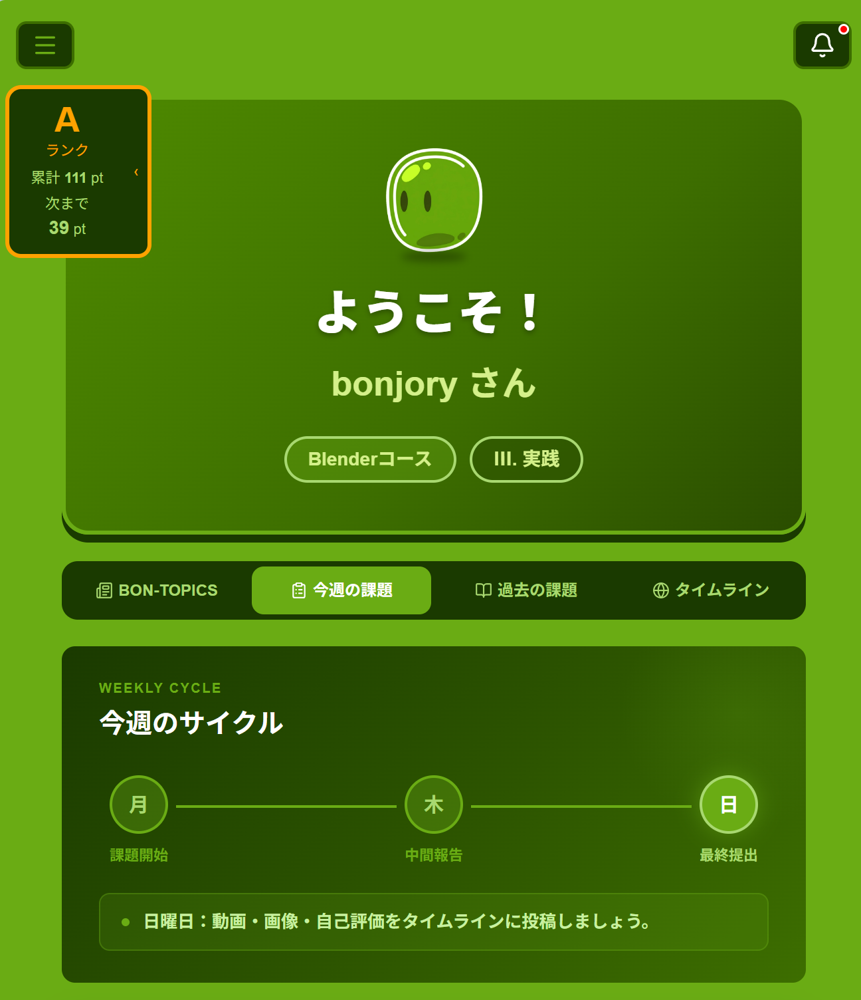
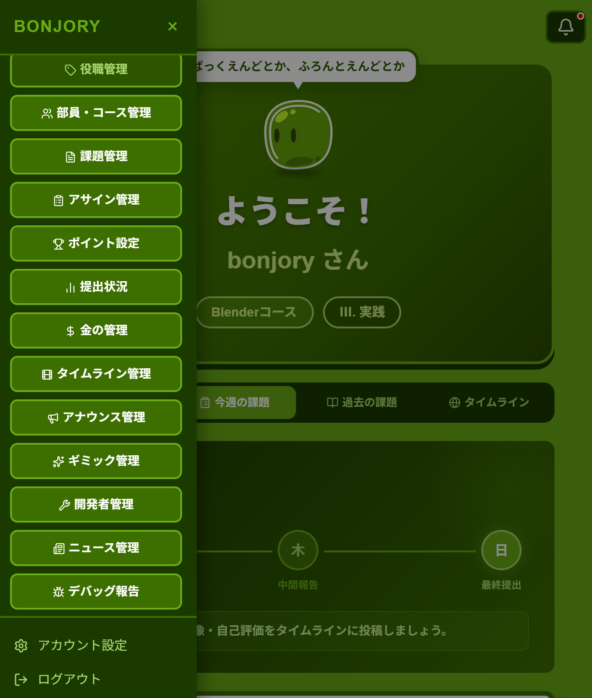
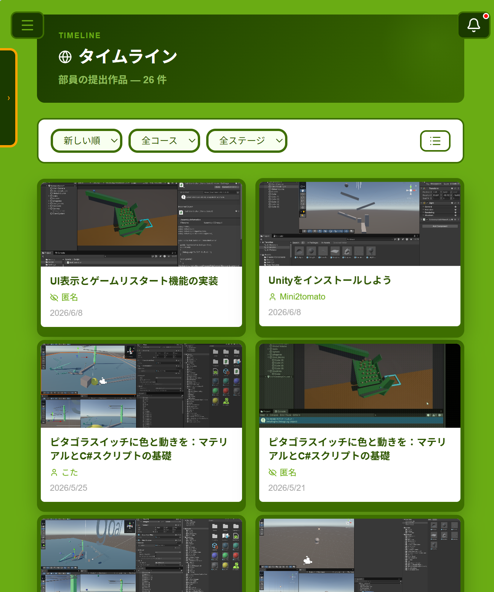
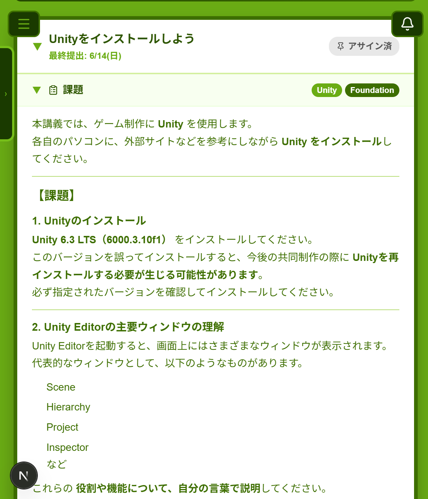
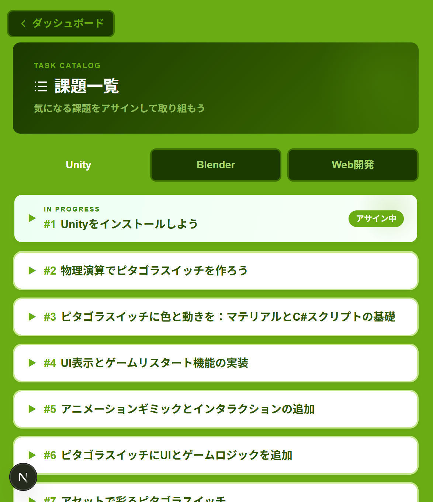
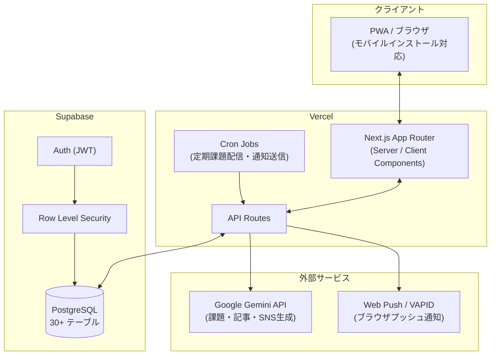
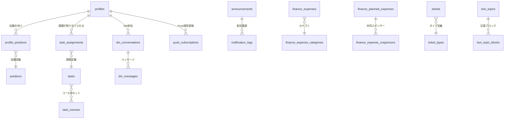
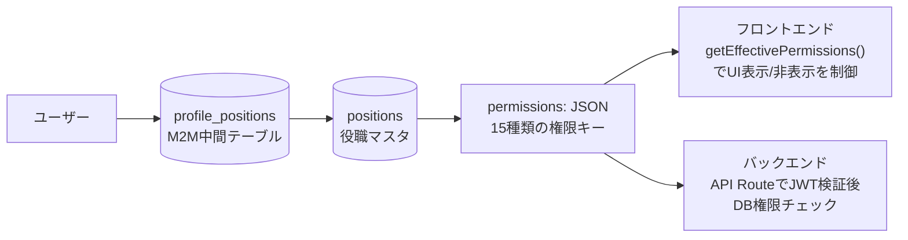

# BONJORY-OS

**ゲーム製作サークル向け統合クラブ管理システム**


---

## スクリーンショット

| ダッシュボード | 管理サイドバー | タイムライン |
|:-:|:-:|:-:|
|  |  |  |

| 課題詳細 | 課題一覧 |
|:-:|:-:|
|  |  |

---

## 背景・動機

ゲーム製作サークル「BONJORY」では、Unity/Blender/Web開発の3コースが並行して動いており、
**課題配信・進捗追跡・財務管理をすべてLINEと口頭でやりとりする**非効率な運営が課題でした。

これを解決するために、**サークル専用の統合管理システム**をゼロから設計・開発しました。
単なる課題管理ツールではなく、AIによる課題自動生成・Webプッシュ通知・ポイント制など、
**部員のモチベーション維持まで含めた設計**にこだわっています。

2026年4月の運用開始以来、10名以上の部員が継続的に利用しており、今後も開発を続けています。

---

## デモ

> テストアカウントで実際のシステムをお試しいただけます。

| 項目 | 内容 |
|------|------|
| **URL** | [https://bonjory-os.vercel.app/login](https://bonjory-os.vercel.app/login) |
| **テストID** | `guest@gmail.com` |
| **パスワード** | `guest123` |

※デモアカウントは閲覧専用です。データの変更・削除はできません。

---

## 主な機能

### 部員向け

| 機能 | 説明 |
|------|------|
| **ダッシュボード** | 週次スケジュール・進捗・ポイント・ランクをひと目で確認 |
| **課題管理** | コース別（Unity / Blender / Web）・ステージ別の課題一覧と提出 |
| **タイムライン** | 課題成果物（動画・画像）をサークル内で共有、コメント可能 |
| **ポイント & ランク** | 行動に応じてポイントが加算され、段階的なランクで可視化 |
| **DM** | 部員と管理者間のプライベートメッセージング |
| **ニュース（BON-TOPICS）** | AI生成によるゲーム・技術トレンドの記事配信 |
| **プッシュ通知** | 課題配信・アナウンスをブラウザ通知で受信（PWA対応） |

### 管理者向け（役職ベースの権限制御付き）

| 機能 | 説明 |
|------|------|
| **課題管理** | 課題のCRUD + Gemini AIによる4モード自動生成 |
| **アサイン管理** | 課題の手動/自動配信、曜日指定スケジュール |
| **提出状況レビュー** | 全部員の提出進捗を一覧で確認・ポイント付与 |
| **財務管理** | 支出・収入の記録、予算計画、共同スポンサー機能 |
| **SNS管理** | AI生成ツイート・スケジュール配信・サンプル管理 |
| **アナウンス** | 全体/個人向け通知、定期・スケジュール配信 |
| **チケット管理** | 7日間有効期限付きリソースチケットの発行・追跡 |
| **ニュース管理** | AIによるMarkdown記事生成・Markdownエディタ付き投稿 |
| **役職 & 権限管理** | 役職ごとに15種類の権限をきめ細かく設定 |
| **開発管理** | バグ報告・機能リクエスト・開発タスク管理 |

---

## 技術スタック

### フロントエンド

| 技術 | 選定理由 |
|------|---------|
| **Next.js 15** (App Router) | SSR/SSGとAPI Routesを一つのフレームワークに統合でき、構成をシンプルに保てる |
| **TypeScript 5** | 権限管理や複雑なデータ構造において型安全性が特に重要だった |
| **Tailwind CSS 4** | デザイントークンの一貫性を保ちながら高速にUIを構築するため |
| **Framer Motion 12** | アニメーションの質が部員のモチベーションに直結すると判断 |

### バックエンド・インフラ

| 技術 | 選定理由 |
|------|---------|
| **Supabase** | RLSによるDB行レベルの権限制御と認証を一括管理できる。個人開発のスピードとセキュリティを両立 |
| **Google Gemini API** | 課題文・記事・SNS投稿の3種類の生成タスクをモデル選択で使い分けできる柔軟性 |
| **Web Push / VAPID** | ネイティブアプリなしでスマートフォンへのプッシュ通知を実現するため |
| **Vercel Cron** | 課題の自動配信と通知の定期送信をサーバーレスで実装するため |

---

## システムアーキテクチャ



---

## データベース設計（主要エンティティ）



---

## 権限管理システム

役職（`positions`）ベースの多層権限モデルを採用。
ユーザーは複数の役職を持てるため、権限はOR合成で評価されます。



**15種類の権限キー:**

`course_management` / `task_management` / `assignment_management` /
`point_settings` / `submission_review` / `finance` / `timeline_management` /
`dm_management` / `announcement_management` / `gimmick_management` /
`dev_management` / `news_management` / `debug` / `ticket_admin` / `sns_management`

---

## AI統合（Google Gemini API）

### 課題自動生成（4モード）

| モード | 説明 |
|--------|------|
| `research` | キーワードから課題タイトル候補を5件生成 |
| `detail` | タイトルから詳細な課題文を執筆 |
| `task` | 既存課題の続きとなる次ステップ課題を生成 |
| `refine` | テキストに修正・編集指示を適用 |

### その他のAI活用

- **ニュース記事生成** — キーワードからMarkdown形式の技術記事を生成
- **SNS投稿生成** — コンテキストから最適なツイートを複数案生成

---

## 今後の展望

- 部内イベントと連動したポイントイベント機能の強化
- 他の開発者との合同開発による機能拡張
- 管理者ダッシュボードの分析・可視化機能の追加
- スマートフォンアプリ（PWA強化）の改善

---

## ディレクトリ構成

```
bonjory-os/
├── app/
│   ├── (pages)/              # 部員向けページ
│   │   ├── dashboard/        # ダッシュボード
│   │   ├── task-list/        # 課題一覧
│   │   ├── account/          # アカウント設定
│   │   └── dm/               # ダイレクトメッセージ
│   ├── admin/                # 管理者向けページ（10機能）
│   ├── api/                  # API Routes
│   │   ├── generate-*/       # AI生成エンドポイント
│   │   ├── cron/             # Vercel Cron ジョブ
│   │   └── ...
│   └── components/           # 共有UIコンポーネント
├── lib/
│   ├── supabase.ts           # Supabaseクライアント
│   ├── permissions.ts        # 権限定義・ヘルパー
│   └── webpush.ts            # Web Push ユーティリティ
├── public/
│   ├── icons/                # アイコン画像
│   └── manifest.json         # PWAマニフェスト
└── supabase/
    └── migrations/           # DBマイグレーション履歴
```

---

## セットアップ

### 1. 依存パッケージをインストール

```bash
npm install
```

### 2. 環境変数を設定

`.env.local` を作成し、以下を設定：

```env
# Supabase
NEXT_PUBLIC_SUPABASE_URL=your_supabase_url
NEXT_PUBLIC_SUPABASE_ANON_KEY=your_anon_key
SUPABASE_SERVICE_ROLE_KEY=your_service_role_key

# Google Gemini AI
GEMINI_API_KEY=your_gemini_api_key

# Web Push (VAPID)
VAPID_PUBLIC_KEY=your_vapid_public_key
VAPID_PRIVATE_KEY=your_vapid_private_key
VAPID_SUBJECT=mailto:your@email.com

# Cron認証
CRON_SECRET=your_cron_secret
```

### 3. データベースのセットアップ

```bash
supabase db push
```

### 4. 開発サーバーを起動

```bash
npm run dev
```

---

## 開発者

**Kunichanko**

- GitHub: [@Kunichanko](https://github.com/Kunichanko)
- Portfolio: （※追加予定）
- Email: （※追加予定）
